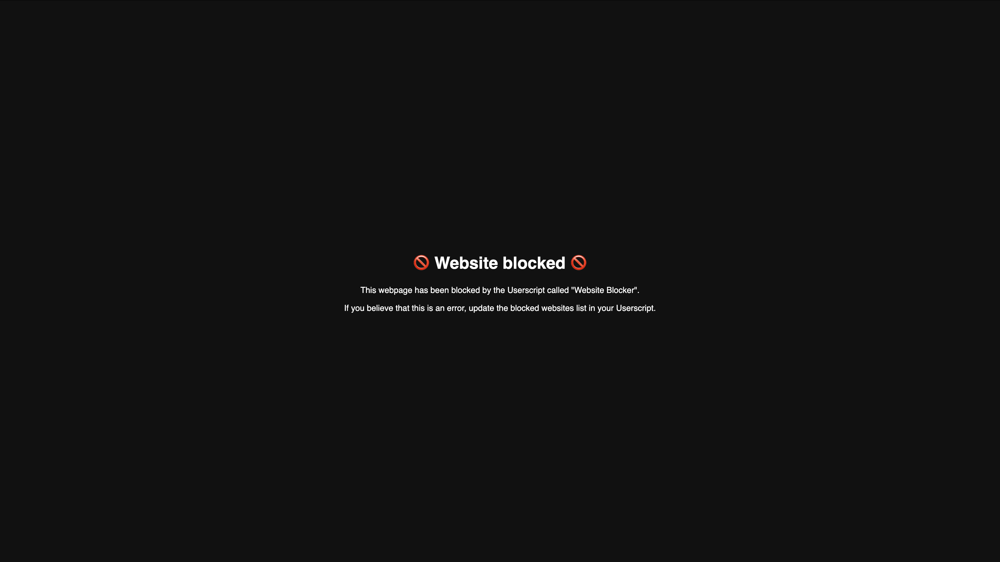

# Website Blocker

The small and efficient Userscript file that blocks certain websites. This file can be used in the browser extensions, such as Tampermonkey.



The only two things that have to be done are pasting in Tampermonkey and adding websites. To add blocked websites, replace the string in line 14 and paste domains or URLs that are separated by a line break (⏎).

The blocked websites list can look, for example, like this:
```
const blocked_websites = `
tiktok.com
youtube.com/shorts
`
```